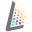

#  uvHolographics

uvHolographics is a small Blender add-on that helps you generate defect segmentation masks to enrich deep learning datasets. This might be useful in cases where there is a small amount of data, a heavy class imbalance, or the need to introduce specific instances that do not yet exist in the real world.

### Requirements

 - Blender >=2.82

### Quickstart

1. Create a new file.
2. Run the add-on script.
3. Set up the basic material.
4. Apply the defects.
5. Finetune the material.
6. Check results.
7. Generate instances.

### Current state

- Basic building blocks to create simple models are in place.

### More advanced use cases

- Fruit defects
	- Model inspiration and textures: CG Boost
- Cell phone defects
	- Model inspiration: Derek Eliott
	- Defect inspiration: Andrew Price

### Deep Learning Demo

Coming.

### Future ideas

- Actually make it into a real add-on.
- Add functionality for multiple defect layers.
- Add a high level modeSwitcher node.

### Relevant literature and other projects

- BlenderProc: A procedural blender pipeline to generate images for deep learning
	- [github](https://github.com/DLR-RM/BlenderProc)
- [Tabernik2019] Segmentation-Based Deep-Learning Approach for Surface-Defect Detection
	- [arxiv](https://arxiv.org/pdf/1903.08536v3.pdf)
- [Shorten2019] A survey on Image Data Augmentation for Deep Learning
	 - [springeropen](https://journalofbigdata.springeropen.com/track/pdf/10.1186/s40537-019-0197-0)
- [Shrivastava2017] Learning from Simulated and Unsupervised Images through Adversarial Training
	- [arxiv](https://arxiv.org/pdf/1612.07828.pdf)
